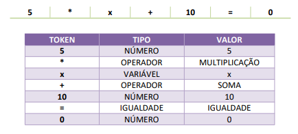

# Compiladores
Trabalho Computacional 02 da Diciplina de Compiladores (Analisador Léxico)

## Enunciado do exercício
Construa um analisador léxico usando Python e PLY que leia uma equação do 1º grau (ax + b = 0) e reconheça os tokens que representam os números, variáveis, operadores (+, -, *, /) e o operador de igualdade, conforme é exemplificado abaixo. Deve ser implementada uma interface de dois campos: entrada da equação do 1º grau e saída da análise léxica. Um botão chamado "Analisar lexicamente" deve ser implementado. Para interface é sugerido a <a href="https://gradio.app/guides/">API Gradio</a>.

